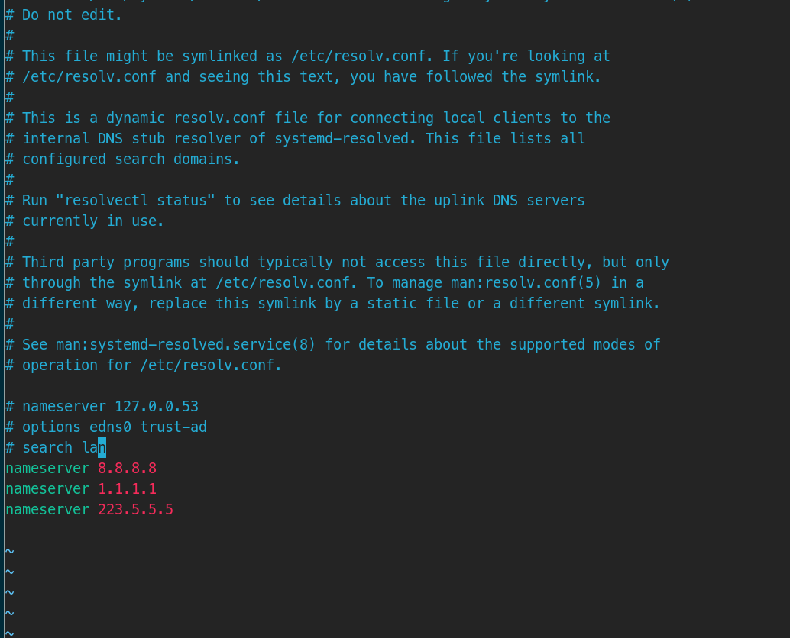
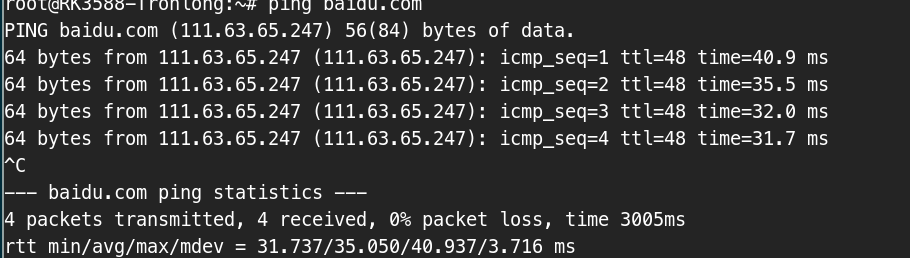

# 开发版网络域名解析问题

## 使用nmcli设置域名解析服务器

```sh
nmcli conn mod <conn name> ipv4.dns "8.8.8.8"
nmcli conn mod <conn name> ipv4.ignore-auto-dnf yes

# 重启
nmcli conn down <conn name>
nmcli conn uo <conn name>
```

## 问题出在resolve.conf里

- 改成


- 能ping通

