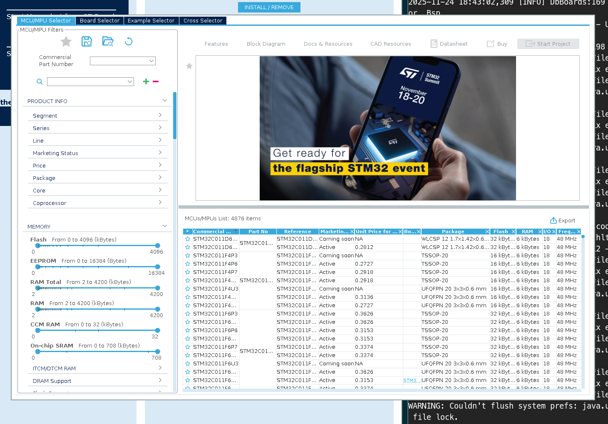

# 在linux上使用STM32CubeMX和hal库编写STM32程序以及下载

- 下载器：fireDAP（CMSIS-DAP的封装）
- wm：riverwm（wayland）
- os：Fedora

## CubeMX存在的问题
- CubeMX是古老的框架写的（SWT，GTK2, X11），要在X11的环境下跑，不然下面这个MCU选择器等等东西的框是空白的。



这个是解决后的（在genome的环境下是好用的，但是在riverwm里就出来一个白框）

- 解决，我是用flatpak装的STM32CubeMX
```sh
flatpak run --env=GDK_BACKEND=x11 \
            --env=SWT_GTK3=0 \
            --env=_JAVA_AWT_WM_NONREPARENTING=1 \
            --socket=x11 \
            --nosocket=wayland \
            com.st.STM32CubeMX
```

> 上面的方法解决后续选择完mcu后依旧出现无法进行配置RCC、GPIO等一系列的问题

- 真正的解决办法：
  - 用 Xephyr启动一个嵌套的X11环境，简单粗暴！！！
```sh
Xephyr :1 -screen 2560x1440 &
DISPLAY=:1 ./STM32CubeMX &
```

## 用法
- 正常的STM32CubeMX的用法，选择生成Makefile的项目
- arm交叉编译器
```sh
sudo dnf install arm-none-eabi-gcc-cs arm-none-eabi-newlib
```

- openocd
```sh
sudo dnf install openocd
```
### 下载

1. openocd配置文件openocd.cfg
```cfg
# use fire-DAP to download the program
source [find interface/cmsis-dap.cfg]

# use SWD
transport select swd
adapter speed 2000

# target chip stm32f4 series
source [find target/stm32f4x.cfg]

# reset mod 
reset_config srst_only srst_nogate connect_assert_srst
```

2. 下载
```sh
openocd -f openocd.cfg \
        -c "program build/myproject.bin 0x08000000 verify reset exit"
```
- -c后面的是openocd要执行的命令
- `0x08000000`是Stm32的falsh的起始地址


# 后续

- 那个cubemx进去之后，虽然能选MCU了，但是，但是MCU的配置RCC、GPIO这些点不了！！！！！！啊啊啊啊啊啊啊啊啊啊啊啊啊啊！！！！！！！！！！！！！！！！！
  - 解决了，又能在riverwm快乐的玩耍了
