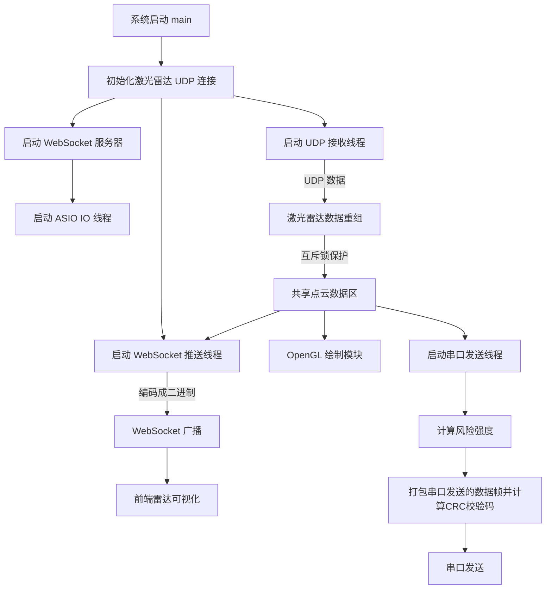
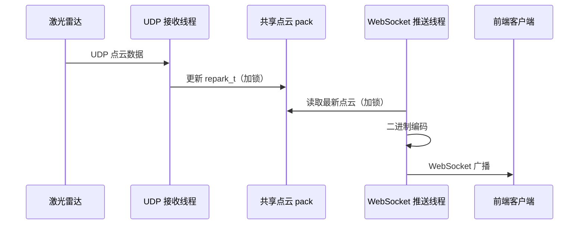
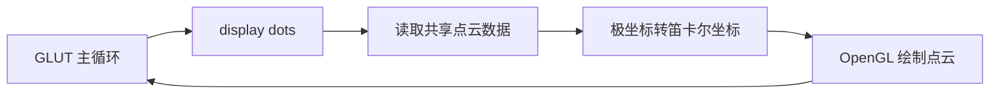
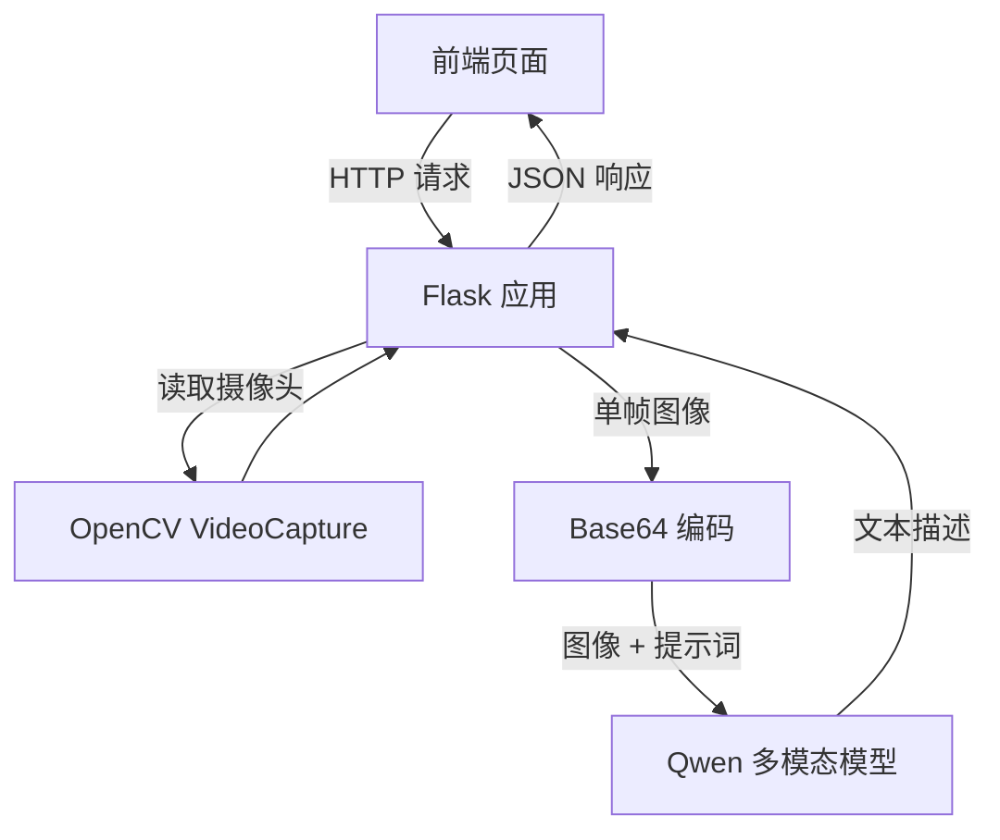
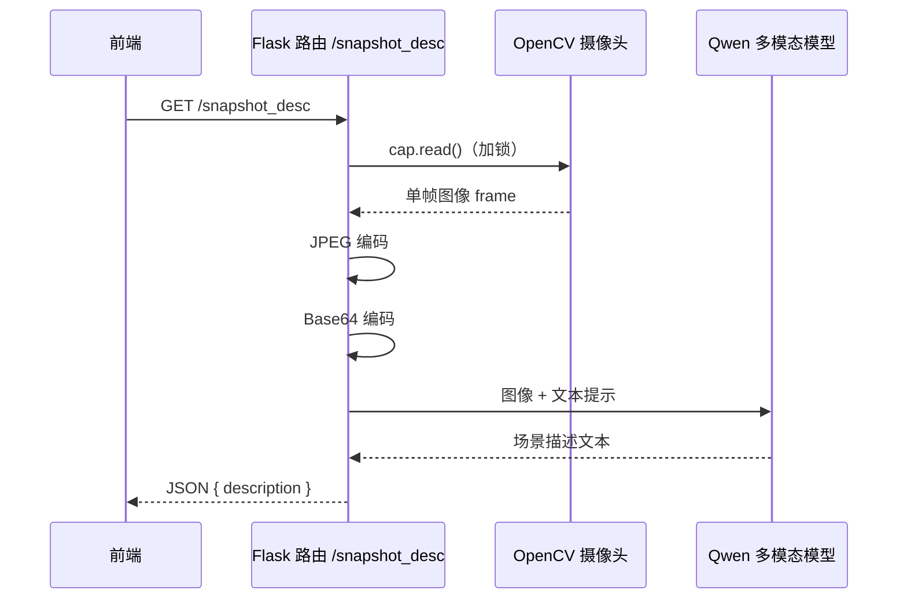
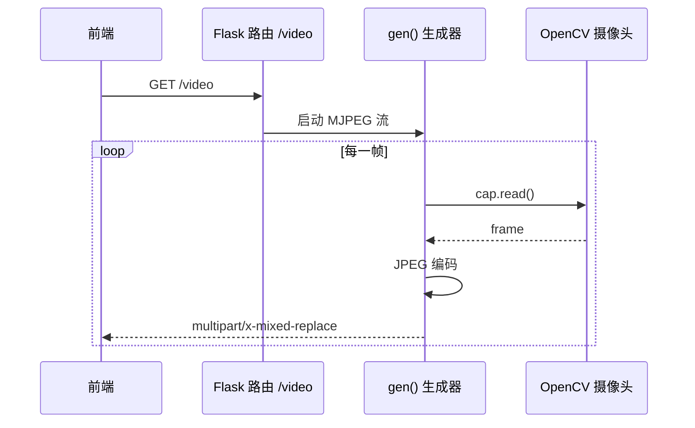
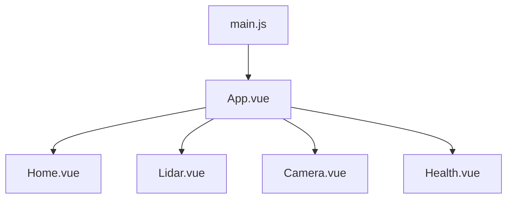
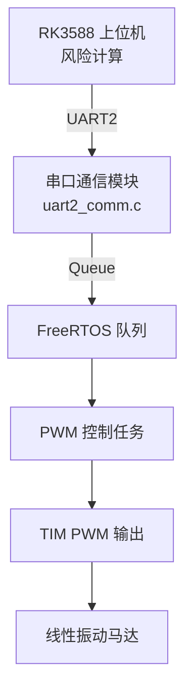
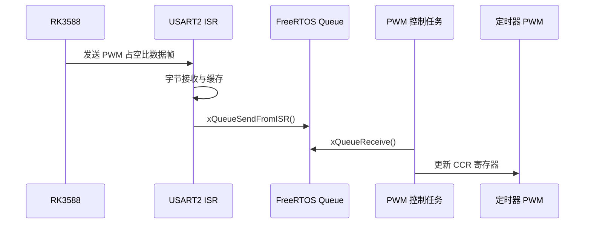

## 具体模块设计

### 后端设计
本系统后端采用 C++ 实现激光雷达数据的实时接收、处理与分发，主要负责从激光雷达设备获取点云数据，并将处理后的结果同步提供给前端可视化界面。该模块以高性能和低延迟为设计目标，综合使用 UDP 通信、多线程并发、WebSocket 数据推送以及 OpenGL 本地可视化等技术手段，构建了一条完整的激光雷达数据处理链路。

- 后端系统流程图

- 多线程激光雷达数据贡献顺序图

系统通过 LakiBeamUDP 类与激光雷达设备建立 UDP 通信连接。在程序启动阶段，后端首先完成雷达通信参数的初始化，指定雷达端与本机端的 IP 地址及端口号，从而建立点云数据传输通道。该设计直接面向雷达设备的底层通信协议，避免了中间层的额外开销，有利于保证数据接收的实时性。

在数据接收阶段，系统专门创建独立的 UDP 接收线程，用于持续监听来自激光雷达的数据流。该线程在运行过程中不断从 UDP 接口读取雷达发送的原始数据包，并调用重组接口将多个数据包整合为一帧完整的点云数据。重组后的点云数据以结构化形式存储于共享变量中，用于后续处理与分发。

由于系统中存在多个并发任务，例如雷达数据接收、前端数据推送以及可选的本地可视化显示，因此后端采用多线程架构进行设计。系统通过互斥锁机制对共享点云数据进行保护，确保在多线程环境下数据访问的安全性和一致性。

在实际运行过程中，雷达接收线程负责不断更新最新点云数据，而数据推送线程与可视化模块则以“只读”方式访问该数据。通过在关键区域加锁并在非关键区域释放锁，系统在保证线程安全的同时，尽量减少锁竞争对性能的影响。

为了将激光雷达数据实时推送至前端，系统在后端引入了 WebSocket 服务模块。数据推送线程周期性地从共享点云数据中拷贝最新一帧数据，并对其进行二进制编码处理。编码后的数据以紧凑格式封装，减少网络传输开销。

WebSocket 服务器运行于独立的 IO 线程中，负责维护与前端的长连接。当新的点云数据生成后，系统通过广播方式将数据推送给所有已连接的前端客户端。该机制使前端无需频繁轮询后端接口，即可获得实时更新的数据，显著提高了整体系统的响应速度。

- 本地opengl绘制激光雷达点云图

除前端数据推送功能外，系统还提供了基于 OpenGL 的本地点云可视化能力，用于开发调试与功能验证。该模块将激光雷达输出的极坐标数据转换为笛卡尔坐标，并根据雷达最大量程进行归一化处理，使点云能够在二维平面中直观呈现。

在绘制过程中，系统采用双缓冲机制与循环刷新方式，实现雷达扫描点的连续绘制。该本地可视化模块在实际部署时可选择关闭，但在开发阶段对于验证雷达数据的正确性、分析点云分布特性具有重要作用。

### 视觉感知模块
该模块实现了一个基于 Flask 的视觉感知服务，由前端通过 HTTP 接口触发。系统通过 OpenCV 从本地摄像头采集图像，一方面以 MJPEG 流形式提供实时视频画面，另一方面在前端请求时对单帧图像进行捕获，并调用 Qwen 多模态模型生成环境语义描述。

系统采用互斥锁机制保证摄像头在多线程环境下的安全访问，并通过 RESTful API 将图像分析结果以 JSON 形式返回给前端，实现视觉感知能力与前端交互的解耦。

- 一次ai环境描述的顺序图

当系统接收到前端对 /snapshot_desc 路由的访问请求时，程序首先通过互斥锁机制对摄像头资源进行保护，确保在多线程环境下图像采集过程的安全性。随后，系统调用 OpenCV 接口从摄像头中获取当前时刻的一帧图像，并对读取结果进行有效性检查，以避免因硬件或驱动异常导致后续处理失败。成功获取图像后，系统将该帧图像编码为 JPEG 格式，并进一步转换为 Base64 字符串，以满足多模态模型接口对图像输入格式的要求。

在完成图像编码后，系统将处理后的图像数据与预设的文本提示共同构造成多模态输入消息，并通过 DashScope SDK 调用 Qwen 多模态视觉语言模型进行推理。模型在接收到图像与文本输入后，对画面内容进行分析并生成简要的语义描述。程序随后对模型返回结果进行解析与校验，在确保返回结构合法的前提下，提取其中的文本描述信息，并以 JSON 格式将结果返回给前端。

- 视频流服务
用于向前端提供摄像头的实时视频流服务。当该路由被访问时，系统通过生成器函数持续从摄像头中读取图像帧，并将每一帧图像编码为 JPEG 格式，以降低数据传输开销并适配浏览器的显示需求。编码后的图像帧按照 multipart/x-mixed-replace 协议格式封装，并通过 HTTP 连接不断推送给前端，从而在浏览器端形成连续的视频画面。

### 前端设计
本系统前端采用 Vue 单页应用（SPA）架构进行设计，通过组件化方式实现对激光雷达数据可视化、摄像头画面展示、系统状态监测以及环境语义描述等功能的统一管理。前端通过 HTTP 与 WebSocket 两种通信方式与后端服务交互，实现了实时数据展示与按需语义分析的协同工作。

在整体结构上，前端以 App.vue 作为根组件，通过 main.js 完成应用初始化与全局配置，并以多个功能页面组件作为业务承载单元。各页面组件围绕不同感知模态与系统功能展开，实现了职责清晰、耦合度低的模块化设计。
#### 功能组件划分与职责说明
- Home 页面：系统总览与导航界面

Home.vue 作为前端的主页面，用于展示系统的整体运行状态与功能入口。该页面承担导航与聚合展示的职责，为用户提供统一的操作入口，使其能够快速切换至激光雷达、摄像头或系统健康状态等功能模块。

该页面本身不直接参与高频数据处理，而是作为各功能模块的组织与调度中心，有效降低了页面复杂度。

- Lidar 页面：激光雷达数据可视化模块

Lidar.vue 负责激光雷达点云数据的实时可视化显示。该组件通过 WebSocket 与后端建立长连接，持续接收后端推送的二进制点云数据，并在前端完成解析与绘制。

在数据处理流程上，该组件将接收到的角度与距离信息转换为前端坐标系下的二维点集，并通过 Canvas 或 WebGL 方式进行绘制，实现雷达扫描效果的实时呈现。该模块是前端中数据更新频率最高的部分，强调实时性与渲染性能。

- Camera 页面：视频流与环境语义展示模块

Camera.vue 用于展示来自后端的摄像头实时画面，并提供环境语义描述的交互接口。实时视频部分通过 HTTP 的 MJPEG 流方式获取，前端仅负责画面展示，不参与复杂计算。

在需要进行环境理解时，用户可触发对 /snapshot_desc 路由的请求，前端接收后端返回的语义描述结果，并将其以文本形式展示在界面中。该设计实现了实时视频与语义分析的解耦，避免高计算开销操作影响视频显示流畅度。

- Health 页面：系统状态监测模块

Health.vue 用于展示系统运行状态与健康信息，如CPU、内存、硬盘使用情况等。该页面通过周期性 HTTP 请求或状态接口获取系统信息，为用户提供系统运行情况的直观反馈，增强系统的可维护性与可监控性。

通过组件化与多通道通信的前端设计，系统实现了激光雷达、摄像头与系统状态等多源信息的统一展示。前端各功能模块职责明确，数据流清晰，能够在保证实时性的前提下完成复杂感知信息的可视化与交互，为多模态感知系统提供了良好的人机交互界面。

### 4.2触觉反馈模块
- stm32下位机软件架构图

在本系统中，STM32F407 作为下位机实时控制单元，主要承担风险映射结果的接收、解析及触觉执行任务。系统整体的数据流与功能模块关系如图 4-X 所示。上位机 RK3588 负责完成环境感知与风险评估计算，并将风险信息映射为多通道 PWM 占空比数据，通过串口发送至 STM32F407。下位机接收到该数据后，在实时操作系统环境下完成数据处理与振动马达驱动，从而实现空间风险到触觉反馈的实时转换。
从软件结构上看，STM32 下位机程序采用模块化设计，并基于 FreeRTOS 构建多任务运行环境。串口通信模块、任务调度模块与 PWM 驱动模块之间通过消息队列进行解耦，各模块职责清晰，数据流向明确。该结构既保证了系统实时性，又为后续功能扩展提供了良好的软件基础。
在数据接收阶段，系统采用 USART2 中断方式完成与上位机的数据通信。RK3588 按照约定的数据帧格式发送包含多通道 PWM 占空比信息的数据帧，STM32F407 在串口接收中断中以字节为单位接收数据，并暂存至接收缓冲区。中断服务程序仅完成数据搬运和基本状态维护，不执行复杂逻辑处理，从而有效缩短中断响应时间，避免对系统实时性的影响。当检测到完整数据帧后，通信模块对数据进行解析与有效性判断，并将得到的 PWM 占空比结果封装后发送至 FreeRTOS 消息队列。
串口接收与任务处理之间的协同关系如图 4-Y 所示。通过 xQueueSendFromISR() 接口，通信模块将数据安全地从中断上下文传递至任务上下文，实现了中断处理与业务逻辑之间的解耦。该机制不仅提高了系统的稳定性，也避免了中断中直接操作硬件资源所带来的潜在风险。
在任务调度层面，系统在 FreeRTOS 环境下创建了 PWM 控制任务作为核心实时任务。该任务以阻塞方式从消息队列中读取最新的 PWM 占空比数据，一旦接收到新数据，便立即对对应定时器的捕获比较寄存器进行更新，从而实时调整振动马达的驱动强度。由于任务采用阻塞式队列读取方式，在无新数据到来时不会占用 CPU 资源，保证了系统调度的高效性。
在执行层面，振动马达的驱动基于 STM32F407 定时器的 PWM 输出功能实现。定时器在系统初始化阶段完成配置并启动，运行过程中无需反复初始化，仅通过动态更新 CCR 寄存器即可完成占空比调整。这种方式减少了硬件配置开销，提高了 PWM 输出的稳定性，确保触觉反馈信号连续、平滑且具有良好的实时响应特性。
综合上述流程，STM32 下位机形成了一条完整的数据处理与执行链路：上位机风险计算结果经串口发送后，由下位机中断接收并解析，通过消息队列传递至 PWM 控制任务，最终驱动振动马达输出对应强度的触觉反馈。该设计构成了一个低延迟、低耦合的实时闭环控制系统，为空间风险信息的触觉表达提供了可靠的技术支撑。

- 串口接收与任务协同流程图

## 实验结果与分析

- 激光雷达数据读取
    - 读取雷达数据
    - 前端渲染
    - 触觉反馈的计算
        - 将360度划分成8个扇区，取每个扇区探测到的障碍物的距离为风险距离$d_i$，以$d_0$为起振距离，$d_1$为满振距离，$x_i = clip(\frac{d_0 - d_i}{d_0 - d_1}, 0, 1)$
        - 为了增强近距离的区分度，采用非线性争强 $\alpha_i = (x_i)^\gamma$
        - 时间平滑：为每个马达通道引入一阶低通滤波
            $$A_i(t) = (1 - \alpha) A_i(t - 1) + \alpha a_i(t) $$
        - 映射成PWM的占功比
            $$ARR = 999$$
           $$ CCR = floor (A_i * ARR + 1/2)$$
    - 串口通信数据帧的定义

| Byte | 含义 | 描述
|------|------| --- |
| 0    | SOF1 = 0xAA | |
| 1    | SOF2 = 0x55 |  |
| 2    | TYPE        | 0x01 = PWM8 |
| 3    | SEQ         | 帧序号（0~255） |
| 4    | LEN         | Payload 长度 = 16 |
| 5-20 | PAYLOAD     | 8 × uint16_t（小端） |
| 21   | CRC8        | 校验 |

- 触觉反馈
    - TIM3的4个通道和TIM4的四个通道用于输出PWM
    - USART2接受TL-3588发送的数据，通过DMA搬运到接受缓冲区
3. 串口接收端流程（STM32）
3.1 UART 硬件接收阶段
    - STM32 的 UART2 外设在硬件层面接收串口数据；
    - 数据通过 DMA 自动搬运至接收缓冲区；
    - 当检测到 IDLE 中断或 DMA 缓冲完成时，触发接收回调。

3.2 数据投递到 RTOS 任务
    - UART 中断/回调函数将接收到的数据块（指针 + 长度）；
    - 投递至 FreeRTOS 消息队列 rx_queue；
    - 中断与协议解析解耦，避免阻塞中断上下文。
3.3 接收任务处理阶段（uart2_rx_task）
    - uart2_rx_task 阻塞等待 rx_queue；
    - 取出一段 DMA 接收的数据；
    - 将数据追加到协议解析缓冲区中（累积式接收）。

3.4 协议解析阶段
在解析缓冲区中循环执行以下操作：
    - 搜索帧头，建立帧同步；
    - 判断当前缓存数据是否满足一整帧长度；
    - 校验数据长度字段；
    - 执行 CRC 校验，验证数据完整性；

成功校验后，提取 Payload 中的 8 路 PWM 数据。
该机制保证：
    - 能正确处理粘包、拆包和丢字节情况；
    - 只有完整且校验正确的帧才会进入控制逻辑。

4. PWM 更新与执行阶段（STM32）
4.1 控制量更新
    - 解析得到的 8 路 PWM 数据传递给电机控制函数；
    - 每一路 PWM 值直接写入对应定时器通道的比较寄存器（CCR）：
4.2 定时器与输出

    - STM32 定时器已配置为固定频率 PWM（如 100 Hz）；
    - ARR 固定为 999，与发送端 PWM 数值范围一致；
    - CCR 的更新立即改变 PWM 占空比；
    - PWM 信号经外部驱动电路驱动振动马达。

- 环境场景描述 
