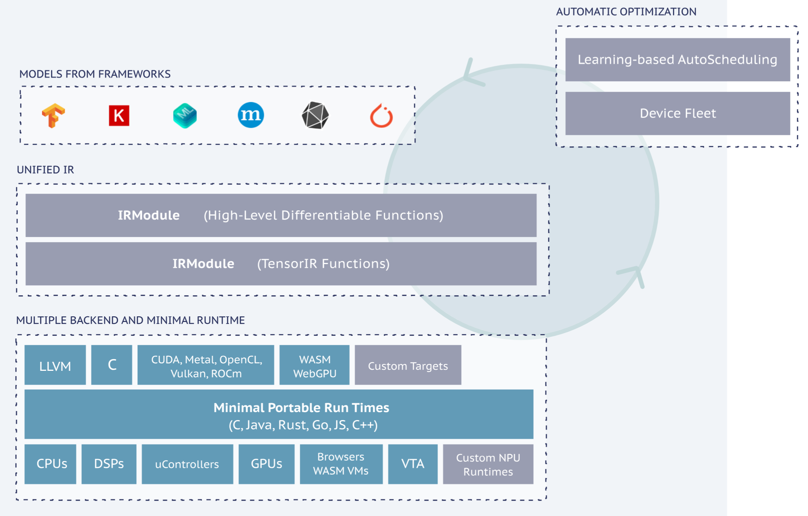

# 编译方向的探索

- 何为编译？ 编译的本质？
    - 对计算的重新解释
    - 对计算的形式化建模和计算
- 传统编译？AI编译？
    - gcc, llvm
    - tvm, mlir
    - 传统编译器，gcc，llvm是一个现代的编译基础设施，其最核心的部分为llvm ir，llvm ir的存在让现代编程语言不用再自己负责编写后端，只需要实现到前端的语法到llvm ir的生成，然后借助llvm提供的后端生成不同平台的目标代码。
    - 在深度学习领域与编程语言类似，有各种各样的深度学习框架（如ONNX, Caffe, PYTorch, Tenserflow等等）和各式各样的计算平台（如GPU, CPU, NPU, TPU等等），为了在不同的计算平台支持各式各样的深度学习框架加速器厂商需要提供不同框架的人工手写高性能的库（类似于早期无IR的编译器，编程语言的开发者或芯片厂商需要实现一个完整的从前端到后端的编译器）。
        - 性能可移植
    - XLA
    - Triton
    - 深度学习编译器的梦想：摆脱计算库的限制，自动生成算子代码实现多硬件的性能可移植性。
- 编译现存的瓶颈？
    - 传统编译？
      - 硬件复杂度失控，传统的做法是模式匹配+手写启发式算法，而随着硬件的复杂度的提升，优化规则愈来愈难写
      - 缺乏对异构硬件的统一抽象
      - 传统编译器是离线的、静态的
      > 硬件复杂度攀升，启发式优化难以为继
      > 抽象能力不足，LLVM IR无法表达现在计算需求
      > 缺乏对异构硬件统一抽象
    - 深度学习编译？
        - 手动调优
        - 巨大的优化搜索空间
        - LLM 和 Transformer 的出现极大扩大了计算图复杂度，使得例如 self-attention、动态 shape、稀疏性等难以被传统 AI 编译器优化。
        - mlir是规则驱动的局部模式匹配
        - 生态碎片化
        - 人工智能发展迅速
        - 没法行业领先平台上展现出顶尖性能
    > 深度学习编译器
    > 
    > （1）抽象与表示层面的限制（Representation Limitations）
    >    - 动态 shape 难优化
    >    - 稀疏性、注意力机制等结构复杂
    >    - 模型演进快，编译器难跟上
    >    - 生态碎片化，算子语义不统一
    >
    >    （2）优化层面的限制（Optimization Limitations）
    >    - 搜索空间爆炸
    >    - ML cost model 精度有限
    >    - 自动调优仍依赖人工定义空间
    >    - 缺乏全局最优的图级优化策略
    >
    >    （3）性能与工程层面的限制（Performance & Practicality）
    >    - 难以超越厂商手写库（cuDNN/cuBLAS）
    >    - 缺乏统一的运行时（runtime fragmentation）
    >    - 不同硬件间性能不可移植
    >    - 工程复杂度高，生态碎片化严重
- 编译的未来方向？
    - 传统编译？
    - 深度学习编译？
      - 单纯的软件编译器优化已经不足够，需要编译器从硬件角度出发参与设计
      - 实现通用的，性能可移植的深度学习编译器需要在设计之初考虑到所有计算平台的计算哲学。
      > 构建一个具备通用性和性能可移植性的深度学习编译器，其体系结构在设计初期必须充分考虑各类硬件平台的计算模型、并行结构、内存层级与执行语义，从而在抽象层面形成统一的计算表示与优化策略，使得上层算子逻辑能够在不同硬件上以最优方式映射与执行。
    - 大一统的compiler

## 深度学习编译器

- TVM

- openXLA

- pp 

- pytorch

